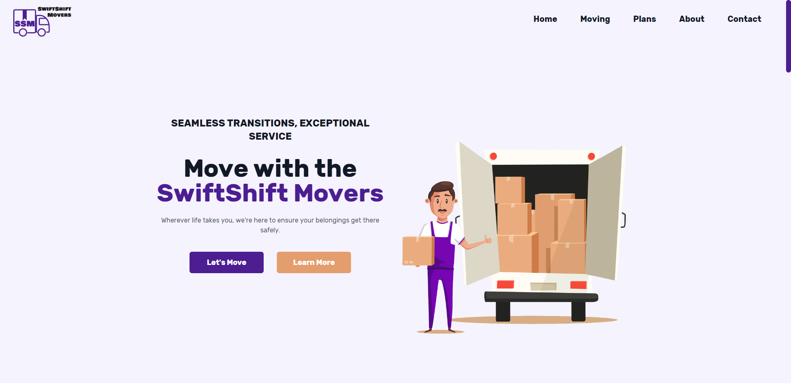

# SwiftShift Movers

[]()
[]()
[](https://app.netlify.com/sites/bncpntk-swiftshift-movers/deploys)

## Getting Started
SwiftShift Movers is a modern website I made for learning purposes and for practicing development skills in React and Tailwind CSS. This fictional moving company offers a sleek and user-friendly interface to explore services, understand the moving process, and get in touch.



## Website
[live demo](https://bncpntk-swiftshift-movers.netlify.app/)

## Tech stack
- Icons: [React Icons](https://react-icons.github.io/react-icons/)
- Scroll: [React Scroll](https://www.npmjs.com/package/react-scroll)
- Frontend: [React](https://reactjs.org/)
- Styling: [Tailwind CSS](https://tailwindcss.com/)
- Deployment: [Netlify](https://www.netlify.com/)


## Install
```bash
# Clone the repository
git clone https://github.com/BncPntk/SwiftShift-Movers.git

# Change into the project directory
cd SwiftShift-Movers

# Install dependencies
npm install
